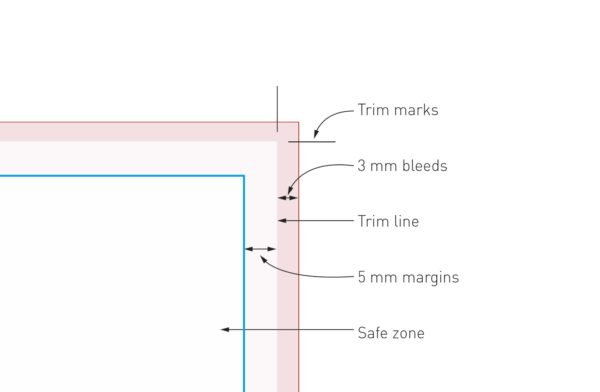

# Preparing PDF files for professional print

Since professional printers print content on a sheet of a paper and then cut it, PDF files for printing need some extra preparation.

Bleed and trim marks have to added to the every page. If using Word or Writer (LibreOffice), this can be a difficult task. Bleed can be added with page size modification, but adding trim marks can be difficult.

This python program adds bleed and trim marks to the existing PDF file. Bleed in this program is white colour.

## What is bleed?

In a print shop, files are first printed and then cut in order to obtain the desired format.

Bleeds is how we call the area where the design extends beyond the edges of the file, to avoid leaving a white line around the borders of your printing product.

Indeed, there is a 1 mm margin of error when trimming the print. If your file does not include bleeds, a thin white line might show all around the edges of your printing product.

We recommend to add 3mm of bleeds on each side.

## What are trim marks?

Trim marks, also called crop marks, are marks that show the printer precisely how a printing document must be cut. They are two small lines, one vertical and one horizontal, at each corner of the file.



# How to use the program?

1. Create python venv using command: `python -m venv .print_venv`
2. Activate the venv:
   - Linux: `source .print_venv/bin/activate`
   - Windows CMD: `.print_venv\Scripts\activate`
   - Windows Powershell: `.\.print_venv\Scripts\activate`
3. Install PyMuPDF: `pip install PyMuPDFf`

Add bleed to the pages. Trim marks will be placed from the bleeds to the actual page size. Actual page size is non processed page size, for example standard A4 size.

```
usage: PDF Print Prep [-h] -b BLEED [-bfp BLEED_FP] [-mo MARKER_OFFSET] [-mw MARKER_WIDTH] -if INPUT_FILE -of OUTPUT_FILE

Program for adding bleed and print (trim) marks to the existing PDF files.

options:
  -h, --help         show this help message and exit
  -b BLEED           Bleed box size in mm. It will add the same bleed extension on all four sides.
  -bfp BLEED_FP      Bleed box size in mm for the first page. If parameter is not passed, [bleed] will be used.
  -mo MARKER_OFFSET  Marker offset in points. If offset 0, marker will touch the trim line.
  -mw MARKER_WIDTH   Marker width in points. Defaultis 0.5.
  -if INPUT_FILE     Input file name.
  -of OUTPUT_FILE    Output file name.
```